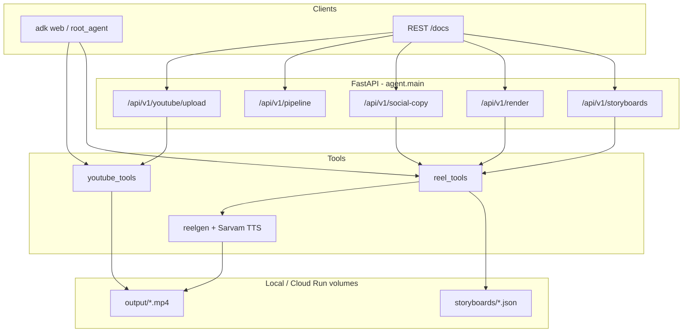

# Educational Reel Agent

[](https://www.python.org/downloads/)
[](https://google.github.io/adk-docs/)
[](https://fastapi.tiangolo.com/)
[](https://www.sarvam.ai/)
[](https://github.com/Yash-Kavaiya/educational-reel-agent/actions/workflows/ci-cd.yaml)

Vertical **1080×1920** educational reels, end to end: storyboard → Sarvam voiceover render → social copy → optional YouTube upload.

Built as a **Google ADK** agent (`adk web`) and a **FastAPI** service for Cloud Run. Theme is Oracle Red / Orange on dark; voice is Sarvam; on-screen handle defaults to `@genai_guru`.

```
topic + content
      │
      ▼
┌─────────────┐     ┌──────────────┐     ┌─────────────┐     ┌──────────┐
│ Storyboard  │ ──► │ reelgen      │ ──► │ Social copy │ ──► │ YouTube  │
│ 5 scenes    │     │ 1080×1920    │     │ YT/IG/X/LI  │     │ optional │
└─────────────┘     └──────────────┘     └─────────────┘     └──────────┘
      ADK tools + REST  /api/v1/*
```

---

## Quick start

Python 3.11+. No GPU required for storyboards or copy.

```bash
git clone https://github.com/Yash-Kavaiya/educational-reel-agent.git
cd educational-reel-agent
python -m venv .venv
# Windows: .venv\Scripts\activate
source .venv/bin/activate
pip install -r requirements-dev.txt
cp .env.example .env          # set SARVAM_API_KEY before rendering
python -m pytest tests/ -q
python -m agent               # http://127.0.0.1:8080/docs
```

ADK Developer UI (needs `pip install -r requirements.txt`):

```bash
adk web
```

The ADK package is `agent`. Root agent: `educational_reel_creator` in `agent/agent.py`.

---

## What you get

| Piece | Behavior |
| --- | --- |
| Storyboard | 5 scenes (title, concept, steps/diagram, comparison, outro), Oracle palette, Sarvam voice |
| Render | `python -m reelgen build` with `SARVAM_API_KEY`; preview 540×960 or HD 1080×1920 |
| Social copy | YouTube, Instagram, X, LinkedIn from the same topic metadata |
| YouTube | Resumable upload from files under `OUTPUT_DIR` only. No browser OAuth on the server |
| Pipeline | One POST to storyboard → render → copy → optional upload |

Voices: `anushka`, `arvind`, `meera`, `kabir`, `diya`, `arya`, `pavithra`.

---

## Architecture



Config is environment-only (`agent/config.py`). No API keys in source.

---

## HTTP API

Base URL: `http://127.0.0.1:8080` (local) or your Cloud Run URL.

| Method | Path | Notes |
| --- | --- | --- |
| `GET` | `/health` | Liveness. Does not echo secrets |
| `GET` | `/docs` | OpenAPI |
| `GET` | `/api/v1/info` | Palette, voices, model |
| `POST` | `/api/v1/storyboards` | Write JSON under `STORYBOARDS_DIR` |
| `GET` | `/api/v1/storyboards` | List; `?series=` filters |
| `GET` | `/api/v1/storyboards/{series}/{file}` | Path-safe read |
| `POST` | `/api/v1/render` | Needs `SARVAM_API_KEY` + `reelgen` |
| `POST` | `/api/v1/batch-render` | Series of topics |
| `POST` | `/api/v1/social-copy` | Platform captions |
| `POST` | `/api/v1/pipeline` | Full flow. `upload_youtube` requires `render=true` |
| `POST` | `/api/v1/youtube/upload` | mp4 must sit under `OUTPUT_DIR` |
| `GET` | `/api/v1/outputs` | List rendered files |
| `GET` | `/api/v1/outputs/{series}/{file}` | Download mp4 only |

### Storyboard

```bash
curl -s http://127.0.0.1:8080/api/v1/storyboards \
  -H "Content-Type: application/json" \
  -d "{
    \"topic\": \"ReAct Pattern\",
    \"content\": \"ReAct interleaves reasoning and acting. Tools execute steps. Observations update the plan.\",
    \"voice\": \"arvind\",
    \"series_title\": \"Oracle AI Agents\",
    \"reel_number\": 1,
    \"total_reels\": 6
  }"
```

Storyboard and social-copy work with no Sarvam key. Render returns `400` until `SARVAM_API_KEY` is set.

---

## Environment

Copy `.env.example` → `.env`. Important variables:

| Variable | Default | Purpose |
| --- | --- | --- |
| `SARVAM_API_KEY` | empty | Required to render |
| `ADK_MODEL` | `gemini-2.0-flash` | ADK LLM |
| `OUTPUT_DIR` | `./output` | Rendered mp4s |
| `STORYBOARDS_DIR` | `./storyboards` | JSON boards |
| `REELGEN_PYTHON` | current interpreter | `python -m reelgen` |
| `REELGEN_MODULE` | `reelgen` | CLI module name |
| `RENDER_TIMEOUT_SECONDS` | `600` | Per-reel cap |
| `CORS_ORIGINS` | `*` | Comma-separated. `*` disables cookies |
| `YOUTUBE_TOKEN_FILE` | `~/.youtube_token.json` | Pre-authorized OAuth user token |
| `DEFAULT_HANDLE` | `@genai_guru` | Outro / captions |
| `DEFAULT_THEME` | `oracle` | Storyboard theme |
| `DEFAULT_SERIES_TITLE` | `Oracle AI Agents` | Series slug |

Never commit `.env`, token JSON, or client secrets.

---

## Docker and Cloud Run

```bash
docker build -t educational-reel-agent .
docker build --build-arg INSTALL_RENDER=false -t educational-reel-agent:api .
./scripts/deploy.sh staging YOUR_PROJECT_ID us-central1
```

The service deploys **authenticated** (`--no-allow-unauthenticated`). Grant `roles/run.invoker` to callers. Store `sarvam-api-key` in Secret Manager.

Cloud Build: `cloudbuild.yaml`. GitHub Actions: `.github/workflows/ci-cd.yaml` (pytest on PR/push; Docker build on push).

---

## Layout

```
educational-reel-agent/
├── agent/
│   ├── agent.py          # ADK root_agent
│   ├── main.py           # FastAPI
│   ├── config.py         # pydantic-settings
│   ├── prompts.py        # instructions (no {placeholders})
│   ├── models.py         # request / storyboard models
│   ├── paths.py          # slugify + traversal guard
│   └── tools/            # storyboard, render, YouTube
├── tests/                # pytest, no network, no reelgen
├── scripts/deploy.sh
├── Dockerfile
├── cloudbuild.yaml
├── requirements.txt          # API + ADK
├── requirements-dev.txt      # pytest stack
└── requirements-render.txt   # Manim / ffmpeg extras
```

ADK instructions live in `agent/prompts.py` and are scanned in CI so `{identifier}` cannot crash session injection.

---

## Tests

```bash
pip install -r requirements-dev.txt
python -m pytest tests/ -q
```

Covers storyboard JSON, voice validation, path traversal, ADK placeholder hygiene, and API round-trips. Render is not executed in CI.

---

## License

No license file in this repository yet. All rights reserved unless the owner adds one.
